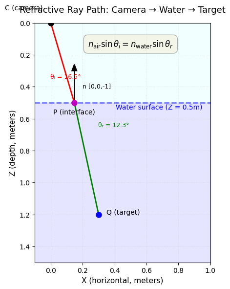

# AquaCal



     [](https://doi.org/10.5281/zenodo.18644658)

Refractive multi-camera calibration for underwater arrays. AquaCal calibrates cameras in air viewing through a flat water surface, using Snell's law to achieve accurate 3D reconstruction in refractive environments.

## Features

- **Snell's law refractive projection** — Accurate ray-tracing through air-water interfaces
- **Multi-camera pose graph** — BFS-based extrinsic initialization for camera arrays
- **Joint bundle adjustment** — Simultaneous optimization of extrinsics, interface distances, and board poses
- **Sparse Jacobian optimization** — Scalable to 10+ cameras with column grouping
- **ChArUco board detection** — Robust corner detection for calibration targets

## Installation

```bash
pip install aquacal
```

## Quick Start

1. Install AquaCal:
   ```bash
   pip install aquacal
   ```

2. Generate a configuration file from your calibration videos:
   ```bash
   aquacal init --intrinsic-dir videos/intrinsic/ --extrinsic-dir videos/extrinsic/
   ```

3. Run calibration:
   ```bash
   aquacal calibrate config.yaml
   ```

Results are saved to `output/calibration.json` with camera intrinsics, extrinsics, interface distances, and diagnostics.

## Documentation

Full documentation is available at [aquacal.readthedocs.io](https://aquacal.readthedocs.io):

- **[Overview](https://aquacal.readthedocs.io/en/latest/overview.html)** — What is refractive calibration and when do you need it?
- **[User Guide](https://aquacal.readthedocs.io/en/latest/guide/index.html)** — Theory, methodology, and coordinate conventions
- **[API Reference](https://aquacal.readthedocs.io/en/latest/api/index.html)** — Detailed module and function documentation
- **[Tutorials](https://aquacal.readthedocs.io/en/latest/tutorials/index.html)** — Interactive Jupyter notebook examples
- **[Configuration Reference](https://aquacal.readthedocs.io/en/latest/api/config.html)** — YAML config schema and options

## Citation

If you use AquaCal in your research, please cite:

```bibtex
@software{aquacal,
  title = {AquaCal: Refractive Multi-Camera Calibration},
  author = {Lancaster, Tucker},
  year = {2026},
  url = {https://github.com/tlancaster6/AquaCal},
  version = {1.2.0},
  doi = {10.5281/zenodo.18644658}
}
```

See [CITATION.cff](CITATION.cff) for full citation metadata.

## Contributing

We welcome contributions! See [CONTRIBUTING.md](CONTRIBUTING.md) for guidelines.

## License

MIT License. See [LICENSE](LICENSE) for details.
