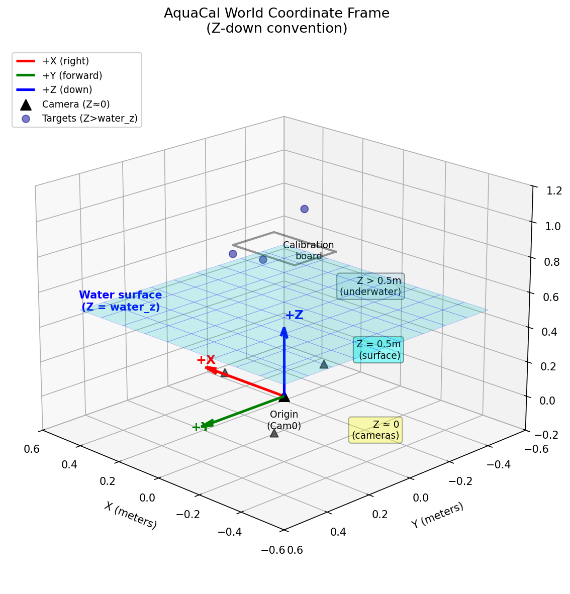

# Coordinate Conventions

AquaCal uses specific coordinate system conventions that are essential for correctly interpreting calibration parameters and using the library for downstream applications. This page documents the world frame, camera frame, extrinsics convention, and interface normal.

## Why Coordinate Conventions Matter

When working with multi-camera calibration, ambiguity in coordinate conventions can lead to subtle bugs:
- Sign errors in transformations (is +Z up or down?)
- Incorrect pixel indexing (is (u,v) = (row,column) or (column,row)?)
- Confusion between camera position and camera extrinsics (R, t)

AquaCal follows OpenCV conventions where applicable, but introduces a **Z-down world frame** to align with the physical setup (cameras above water, targets below).

## World Frame

The world coordinate frame is anchored at the **reference camera's optical center** (typically cam0). All 3D points, camera positions, and the water surface are expressed in this frame.

| Axis | Direction | Notes |
|------|-----------|-------|
| +X   | Horizontal right (when viewed from above) | Perpendicular to camera's forward direction |
| +Y   | Horizontal forward (when viewed from above) | Camera's nominal forward direction |
| +Z   | **Down** (into water) | Depth increases with Z; opposite to typical computer graphics convention |

**Units:** All internal values are in **meters**. Millimeters are used only for human-readable output and display.

### Key Z-Values

The Z-axis stratifies the physical setup into three regions:

- **Z ≈ 0**: Camera positions (cameras are roughly coplanar near the world origin)
- **Z = water_z**: Water surface plane (typically 0.3-1.0m, depending on rig height above water)
- **Z > water_z**: Underwater targets (calibration board, points of interest)

The diagram below shows the world coordinate frame in 3D:

:::{admonition} Gotcha: World Z-down vs. Camera Y-down
:class: warning

Don't confuse the world frame's Z-down convention with the camera frame's Y-down convention. These are **different frames** with different axis orientations.

- **World frame**: +Z points down (into water). Used for expressing 3D points and camera positions.
- **Camera frame**: +Y points down (in the image). Used for pixel coordinates and camera-relative geometry.

When a camera is pointing straight down (common in AquaCal rigs), the camera's +Z axis (optical axis, forward) aligns with the world's +Z axis (down), but the camera's +Y axis (down in image) points in a different direction depending on the camera's roll angle.
:::

## Camera Frame (OpenCV Convention)

Each camera has its own local coordinate frame, following the **OpenCV convention**:

| Axis | Direction | Notes |
|------|-----------|-------|
| +X   | Right in the image | Corresponds to increasing pixel column (u) |
| +Y   | Down in the image | Corresponds to increasing pixel row (v) |
| +Z   | **Forward** (optical axis) | Points into the scene; depth increases with Z |

**Origin:** The camera's optical center (the 3D point that projects to the principal point in the image).

### Pixel Coordinates

Pixel coordinates (u, v) are defined as:

| Component | Meaning | Range |
|-----------|---------|-------|
| u | Column index (horizontal) | 0 to image_width - 1 |
| v | Row index (vertical) | 0 to image_height - 1 |

**Origin:** Top-left corner of the image at (u, v) = (0, 0).

**Convention:** `pixel[0] = u = column`, `pixel[1] = v = row`.

The principal point (cx, cy) in the camera intrinsic matrix K maps to the ray `[0, 0, 1]` in camera frame (the optical axis).

:::{admonition} Gotcha: OpenCV Y-down means row 0 is at the top
:class: warning

In OpenCV's camera frame convention, +Y points **down** in the image. This means:
- Pixel row 0 is at the **top** of the image
- Pixel row `image_height - 1` is at the **bottom** of the image

This is the standard computer graphics convention for image arrays (origin at top-left), but it's opposite to typical mathematical plotting where Y increases upward.

When visualizing camera positions or reprojection errors, be careful not to flip the Y-axis inadvertently.
:::

## Extrinsics Convention

Camera extrinsics (R, t) define the transformation from **world frame** to **camera frame**:

$$
\mathbf{p}_{\text{cam}} = \mathbf{R} \mathbf{p}_{\text{world}} + \mathbf{t}
$$

where:
- **R** is a 3×3 rotation matrix (maps world axes to camera axes)
- **t** is a 3×1 translation vector (in camera frame)

### Camera Center in World Frame

The camera's position in world coordinates (often denoted **C**) is derived from the extrinsics:

$$
\mathbf{C} = -\mathbf{R}^T \mathbf{t}
$$

This is the 3D point in world frame that corresponds to the origin of the camera frame (the optical center).

### Reference Camera

The **reference camera** (typically cam0) is fixed at the world origin:

- **R = I** (identity matrix: no rotation)
- **t = [0, 0, 0]** (zero translation)
- **C = [0, 0, 0]** (camera center at world origin)

All other cameras' extrinsics are expressed relative to this reference frame.

:::{admonition} Note: Extrinsics vs. Camera Position
:class: tip

Extrinsics (R, t) and camera position C are related but distinct:
- **Extrinsics (R, t)**: Transform points from world to camera frame (used for projection)
- **Camera position C**: Where the camera sits in the world (used for ray origins, visualizations)

To get C from (R, t): `C = -R^T @ t`

To get (R, t) from C and orientation: Requires specifying the camera's orientation (e.g., pointing down, with a given roll angle).
:::

## Interface Normal

The water surface is modeled as a flat plane at Z = water_z. The **interface normal** is the unit vector perpendicular to this plane:

$$
\mathbf{n} = [0, 0, -1]
$$

**Direction:** Points **from water toward air** (upward, opposite to +Z).

### Why This Convention?

The normal points **outward from the denser medium** (water). This is a standard convention in optics:
- For air-to-water refraction (camera viewing underwater target): incident ray is opposite to normal
- For water-to-air refraction (underwater light source viewed from air): incident ray is same direction as normal

The {func}`~aquacal.core.refractive_geometry.snells_law_3d` function handles normal orientation automatically based on the incident ray direction, so you don't need to manually flip the normal.

:::{admonition} Gotcha: interface_distance is a Z-coordinate, not a distance
:class: warning

Despite its name, `interface_distance` in AquaCal's internal representation is actually the **Z-coordinate of the water surface** (i.e., the value of water_z), **not** the physical distance from a camera to the water.

The physical camera-to-water gap is computed as:

$$
h_c = \text{water_z} - C_z
$$

where $C_z$ is the camera's Z position in world coordinates.

After optimization, all cameras receive the same `interface_distance` value (the global water_z). This reparameterization eliminates a degeneracy between camera Z position and interface distance. See the [Refractive Geometry](refractive_geometry.md) page for details.
:::

## Transforms

AquaCal provides several transformation utilities in {mod}`aquacal.utils.transforms`:

### Pose Composition

`compose_poses(T1, T2)` computes the combined transformation when T2 is applied first, then T1:

$$
\mathbf{R}_{\text{out}} = \mathbf{R}_1 \mathbf{R}_2, \quad
\mathbf{t}_{\text{out}} = \mathbf{R}_1 \mathbf{t}_2 + \mathbf{t}_1
$$

**Usage:** If T2 maps frame A → frame B and T1 maps frame B → frame C, then `compose_poses(T1, T2)` maps frame A → frame C.

### Pose Inversion

`invert_pose(R, t)` converts a world→camera transform into a camera→world transform (or vice versa):

$$
\mathbf{R}_{\text{inv}} = \mathbf{R}^T, \quad
\mathbf{t}_{\text{inv}} = -\mathbf{R}^T \mathbf{t}
$$

### Rodrigues Vectors

Rotations are often represented as **Rodrigues vectors** (compact 3-element form):

- **Axis of rotation:** `rvec / ||rvec||`
- **Angle of rotation:** `||rvec||` (in radians)
- **Identity rotation:** `rvec = [0, 0, 0]`

Convert to matrix: `R = cv2.Rodrigues(rvec)[0]` (note the `[0]` to extract the matrix from the tuple).

## See Also

- [Refractive Geometry](refractive_geometry.md) — How coordinate frames interact with refractive ray tracing
- [Optimizer Pipeline](optimizer.md) — How extrinsics and water_z are optimized in the calibration pipeline
- {mod}`aquacal.utils.transforms` — Transformation utilities API reference
