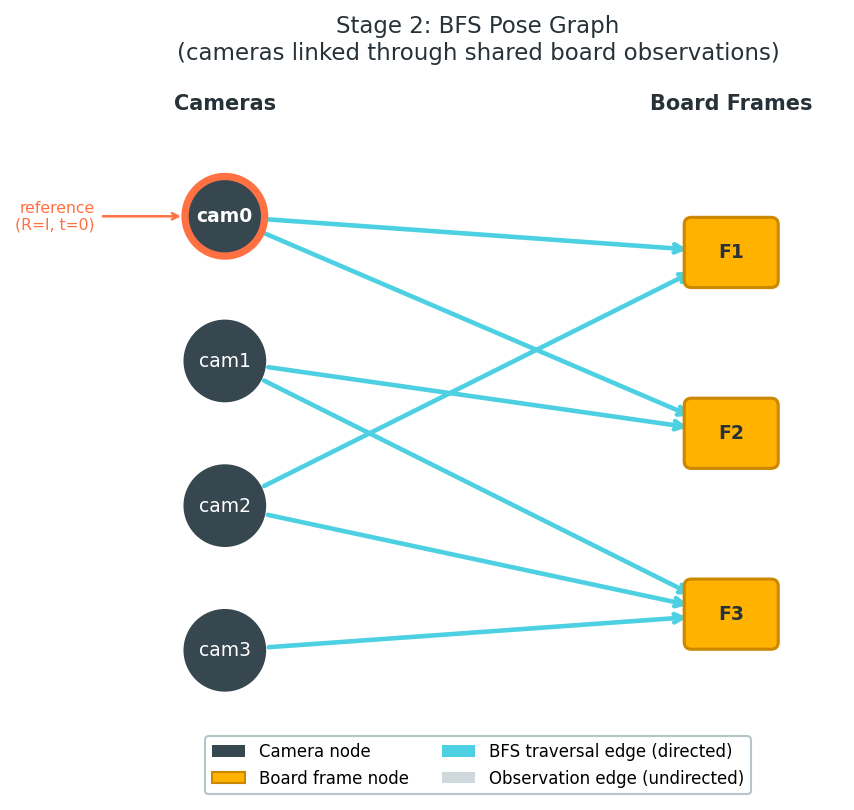
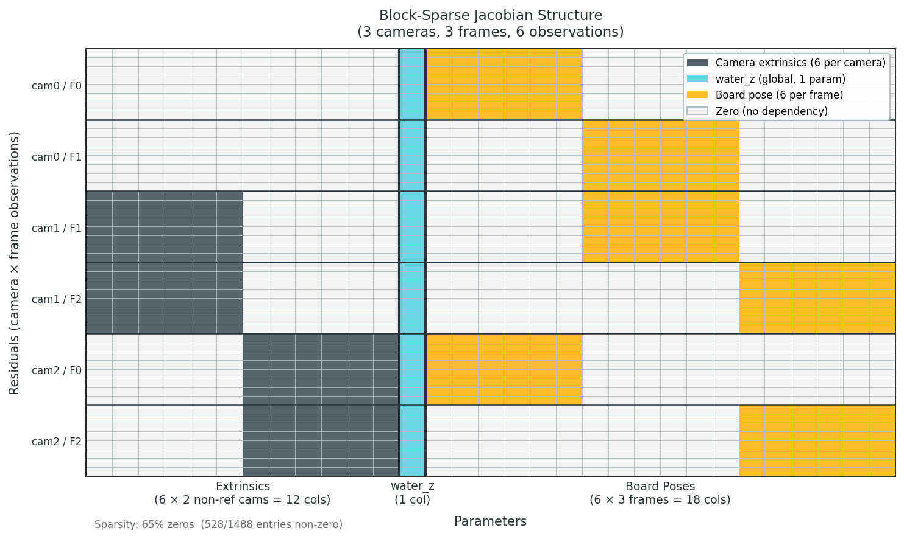

# Optimizer Pipeline

AquaCal's calibration pipeline runs four sequential stages to produce a complete multi-camera calibration. This page explains how the pipeline works, what each stage optimizes, and the sparse Jacobian strategy used for efficient bundle adjustment.

## Pipeline Overview

The calibration proceeds through four stages:

```{mermaid}
flowchart LR
    I1["In-air videos<br/>Board params"] --> S1
    I2["Underwater videos<br/>Board params"] --> S2

    S1["**Stage 1**<br/>In-air Intrinsics<br/><small>(OpenCV)</small>"]
    S2["**Stage 2**<br/>Extrinsic Init<br/><small>(BFS/PnP)</small>"]
    S3["**Stage 3**<br/>Joint Refractive BA<br/><small>(nonlinear)</small>"]
    S4["**Stage 4**<br/>Intrinsic Refinement<br/><small>(optional)</small>"]

    S1 --> S2
    S2 --> S3
    S3 --> S4
    S4 --> O["Refined K, R, t<br/>water_z, boards"]

    classDef stage fill:#00897B,stroke:#004D40,color:#fff
    classDef data fill:#E0F7FA,stroke:#4DD0E1,color:#263238
    class S1,S2,S3,S4 stage
    class I1,I2,O data
```

Each stage builds on the previous one, progressively refining the calibration. Stages 3 and 4 use the same optimization infrastructure ({mod}`aquacal.calibration._optim_common`), just with different parameter sets.

## Stage 1: Intrinsic Calibration

**What it does:** Standard per-camera calibration using in-air checkerboard images.

**Method:** OpenCV's `cv2.calibrateCamera()` (pinhole model) or `cv2.fisheye.calibrate()` (equidistant fisheye model).

**Input:**
- In-air calibration videos (one per camera)
- ChArUco board parameters (squares_x, squares_y, square_size, marker_size)

**Output:**
- Camera intrinsic matrix **K** (3×3): `[[fx, 0, cx], [0, fy, cy], [0, 0, 1]]`
- Distortion coefficients (5-element or 8-element array)

**Why in-air?** Intrinsic calibration (lens distortion, focal length, principal point) requires many observations at varied angles and depths. Performing this underwater would be impractical. Since intrinsics are properties of the lens, not the medium, we can calibrate in air and use the same intrinsics for underwater observations.

See {func}`aquacal.calibration.intrinsics.calibrate_intrinsics_all` for implementation.

## Stage 2: Extrinsic Initialization

**What it does:** Initialize camera positions (extrinsics) and the water surface Z-coordinate by building a pose graph from shared underwater board observations.

**Method:**
1. Detect ChArUco corners in all cameras across all underwater frames
2. Build a **pose graph**: each camera-frame pair with detections is a node, edges connect nodes that observe the same board
3. **BFS traversal**: Starting from the reference camera (R=I, t=0), chain refractive PnP solutions through the graph to locate other cameras
4. Multi-frame averaging to reduce noise in extrinsic estimates
5. Compute initial water_z from the reference camera's average interface distance

**Input:**
- Underwater calibration videos (all cameras)
- Intrinsics from Stage 1
- ChArUco detections across all frames

**Output:**
- Initial extrinsics (R, t) for each camera
- Initial water_z (global water surface Z-coordinate)
- Initial board poses (rvec, tvec) for each frame

**Why BFS?** Cameras in an AquaCal rig typically have **non-overlapping fields of view**. Direct pairwise camera-to-camera pose estimation isn't possible. Instead, we use the calibration board as a "connector": if cam0 and cam1 both observe the same board pose, we can chain their board-to-camera transforms to get a cam0-to-cam1 transform.



See {func}`aquacal.calibration.extrinsics.estimate_extrinsics` for implementation.

## Stage 3: Joint Refractive Bundle Adjustment

**What it does:** Jointly optimize camera extrinsics, global water surface Z, and board poses to minimize refractive reprojection error.

**Method:** Nonlinear least-squares optimization using `scipy.optimize.least_squares`.

### Parameters Optimized

The parameter vector layout is:

```
[tilt(0 or 2) | extrinsics(6*(N-1)) | water_z(1) | board_poses(6*F) | intrinsics(4*N or 0)]
```

where:
- **tilt (0 or 2)**: Optional interface tilt parameters (rx, ry) if `normal_fixed=False`. Usually omitted (flat water assumption).
- **extrinsics (6 per camera)**: Rodrigues vector (3) + translation vector (3) for each **non-reference** camera. Reference camera (cam0) is fixed at R=I, t=0.
- **water_z (1)**: Global water surface Z-coordinate. Same value for all cameras.
- **board_poses (6 per frame)**: Rodrigues vector (3) + translation vector (3) for each frame's board pose.
- **intrinsics (0)**: Not optimized in Stage 3 (deferred to Stage 4 if requested).

**Example:** For a 3-camera rig with 50 frames:
- Extrinsics: 6 × (3 - 1) = 12 parameters
- water_z: 1 parameter
- Board poses: 6 × 50 = 300 parameters
- **Total: 313 parameters**

### Cost Function

The cost function computes **refractive reprojection error** for every observed corner across all cameras and frames:

$$
\text{residual}_{i,j,k} = \text{pixel}_{i,j,k}^{\text{observed}} - \text{refractive\_project}(\mathbf{Q}_{j,k}, \text{cam}_i, \text{water\_z})
$$

where:
- i = camera index
- j = frame index
- k = corner index within that frame
- **Q_{j,k}** is the 3D world position of corner k in frame j (computed from board pose)

The refractive projection uses the Newton-Raphson solver (see [Refractive Geometry](refractive_geometry.md)) to account for light bending at the water surface.

**Loss function:** Soft-L1 (Huber-like) loss for robustness to outliers:

$$
\rho(r) = 2 \left( \sqrt{1 + r^2} - 1 \right)
$$

This down-weights large residuals (e.g., detection errors, board motion blur) while preserving gradient information.

### Bounds

- **water_z**: `[0.01, 2.0]` meters (must be positive and below cameras; upper bound is generous)
- **Board tvec[2]** (Z-coordinate): Must be greater than water_z (boards are underwater)
- **Extrinsic rvec**: Unbounded (rotations can take any value)
- **Extrinsic tvec**: Unbounded (but typically stay near initial values from Stage 2)

See {func}`aquacal.calibration.interface_estimation.optimize_interface` for implementation.

:::{admonition} Gotcha: water_z is unobservable in non-refractive mode
:class: warning

When running calibration with `n_air = n_water = 1.0` (as a comparison baseline to standard calibration), water_z has **zero analytical gradient**. Light travels in straight lines regardless of the interface position.

Despite this, water_z may drift during optimization due to:
1. **Boundary penalties**: Soft constraint to keep board Z > water_z pushes water_z downward
2. **Numerical noise**: In a flat cost valley, small numerical errors accumulate

The final water_z value in non-refractive mode is arbitrary and meaningless. All other parameters (extrinsics, board poses) are unaffected.

Use refractive mode (default n_water = 1.333) for actual calibration. Non-refractive mode is useful only for controlled comparisons.
:::

## Stage 4: Intrinsic Refinement (Optional)

**What it does:** Re-optimize all parameters from Stage 3 **plus** per-camera focal length and principal point.

**Method:** Same as Stage 3, but the parameter vector includes:

```
intrinsics(4*N): [fx_0, fy_0, cx_0, cy_0, fx_1, fy_1, cx_1, cy_1, ...]
```

appended to the end (after board poses).

**When to use:**
- **Use Stage 4** if initial intrinsic calibration was noisy (few in-air frames, poor coverage)
- **Skip Stage 4** if intrinsics are well-determined from Stage 1 (typical case)

Refining intrinsics increases parameter count by 4N and can slow convergence. It's most useful when intrinsic estimates are suspect.

**Note:** Distortion coefficients are **always held fixed**. Only (fx, fy, cx, cy) are refined.

See {func}`aquacal.calibration.refinement.joint_refinement` for implementation.

## Sparse Jacobian Strategy

Bundle adjustment with hundreds of parameters is computationally expensive. The Jacobian matrix (derivatives of residuals w.r.t. parameters) is **sparse**: each reprojection residual depends on only a small subset of parameters.

### Block-Sparse Structure

Each residual (2D reprojection error of one corner) depends on:
- **6 extrinsic params** (for the camera observing it)
- **1 water_z param** (global)
- **6 board pose params** (for the frame containing it)
- **4 intrinsic params** (for the camera, if refining intrinsics)

Total: at most **14-17 columns** touched per residual row.



For a 13-camera, 100-frame rig:
- Parameters: ~630 (extrinsics + water_z + board poses)
- Each row touches ~13 columns → **98% sparse**

### Sparse Finite Differences with Dense Solver

`scipy.optimize.least_squares` supports Jacobian sparsity via the `jac_sparsity` parameter, but this **forces the LSMR trust-region solver**, which can diverge on ill-conditioned bundle adjustment problems.

AquaCal uses a **custom Jacobian callable** that:
1. Computes the Jacobian via sparse finite differences using `scipy.optimize._numdiff.approx_derivative` with column grouping
2. Returns a **dense** matrix (`.toarray()`)
3. Allows the **exact (QR) trust-region solver** to be used (stable, better convergence)

**Column grouping** reduces the number of function evaluations: independent columns can be finite-differenced simultaneously. For the 630-parameter rig:
- Without grouping: 630 evaluations
- With grouping: ~50 groups → **~12× fewer evaluations**

For very large problems (e.g., 1000+ parameters), a `dense_threshold` parameter automatically switches to sparse (LSMR) mode to avoid memory overflow.

See {func}`aquacal.calibration._optim_common.make_sparse_jacobian_func` for implementation.

:::{admonition} Note: Sparse Jacobian is an advanced optimization
:class: tip

The sparse Jacobian strategy is transparent to most users. It's enabled by default and auto-tunes based on problem size.

If you're modifying the calibration pipeline to add new parameter types, you'll need to update {func}`~aquacal.calibration._optim_common.build_jacobian_sparsity` to reflect which residuals depend on which parameters.
:::

## Auxiliary Camera Registration

Some cameras (e.g., wide-angle overview cameras) may degrade the joint optimization due to:
- Poor intrinsic calibration (fisheye lenses are harder to calibrate)
- Different viewing geometry (viewing at steep angles increases refractive effects)

AquaCal supports **auxiliary cameras** that are excluded from Stages 2-4 and registered post-hoc against fixed board poses and water_z.

**Method:**
1. Run Stages 1-4 with primary cameras only
2. For each auxiliary camera: 6-parameter (extrinsics-only) or 10-parameter (extrinsics + intrinsics) optimization against fixed board poses

This prevents auxiliary cameras from poisoning the primary solution while still providing calibrated extrinsics for all cameras.

See {func}`aquacal.calibration.interface_estimation.register_auxiliary_camera` for implementation.

## Camera Models

AquaCal supports three distortion models for intrinsic calibration (Stage 1). Choosing the right model depends on your lens type and available calibration data.

### Standard Pinhole Model (5 parameters)

**Distortion coefficients:** k1, k2, p1, p2, k3

**Radial distortion:** Polynomial model
$$
r_{\text{distorted}} = r (1 + k_1 r^2 + k_2 r^4 + k_3 r^6)
$$

**Tangential distortion:** Accounts for lens decentering (p1, p2)

**When to use:**
- Default for most cameras
- Lenses with moderate distortion (< 90° field of view)
- Standard rectilinear lenses

**Auto-simplification:**
With few calibration frames, higher-order coefficients (k3, k2) can overfit, causing the distortion polynomial to diverge outside the calibrated region. AquaCal detects this via monotonicity checks and automatically retries with simpler models:

1. **Full model:** k1, k2, p1, p2, k3 (5 parameters)
2. **If roundtrip validation fails:** Fix k3 = 0 (4 parameters)
3. **If still failing:** Fix k3 = k2 = 0 (2 radial parameters: k1, p1, p2)

This auto-simplification prevents overfitting while preserving model accuracy for well-calibrated cases.

**Implementation:** See {func}`aquacal.calibration.intrinsics.calibrate_intrinsics_single` (lines 351-379) for the progressive simplification logic.

### Rational Model (8 parameters)

**Distortion coefficients:** k1, k2, k3, k4, k5, k6, p1, p2

**Radial distortion:** Rational polynomial (numerator and denominator)
$$
r_{\text{distorted}} = r \frac{1 + k_1 r^2 + k_2 r^4 + k_3 r^6}{1 + k_4 r^2 + k_5 r^4 + k_6 r^6}
$$

**When to use:**
- Wide-angle lenses with extreme barrel or pincushion distortion
- Standard 5-parameter model gives RMS > 1.0 pixels despite good calibration data
- You have 50+ in-air calibration frames with good spatial coverage

**Auto-simplification:** ❌ **No** — Rational model does not auto-simplify. If you suspect overfitting (very low Stage 1 RMS but high validation errors), downgrade to the standard model.

**Configuration:**
```yaml
rational_model_cameras:
  - cam1  # Wide-angle camera needing 8-parameter model
```

**Note:** Rational model cameras cannot be fisheye cameras (mutually exclusive).

### Fisheye Model (4 parameters, equidistant)

**Distortion coefficients:** k1, k2, k3, k4 (equidistant projection model)

**Projection:** Equidistant fisheye model (not polynomial radial)
$$
r_{\text{distorted}} = \theta (1 + k_1 \theta^2 + k_2 \theta^4 + k_3 \theta^6 + k_4 \theta^8)
$$
where θ is the angle from optical axis.

**When to use:**
- True fisheye lenses (> 120° field of view)
- GoPro cameras (depending on lens mode)
- Ultra-wide security cameras

**Auto-simplification:** ❌ **No** — Fisheye model does not auto-simplify. If calibration quality is poor, check video quality and spatial coverage.

**Configuration:**
```yaml
auxiliary_cameras:
  - cam2  # Fisheye cameras must be auxiliary

fisheye_cameras:
  - cam2  # Subset of auxiliary_cameras
```

**Important constraints:**
- Fisheye cameras **must** be listed in `auxiliary_cameras` (cannot participate in primary Stage 2-4 optimization)
- Fisheye cameras **cannot** also be rational model cameras

### Allowed Camera Combinations

| Camera Lists | Constraints |
|--------------|-------------|
| `cameras` (primary) | First camera is the reference camera (world origin) |
| `auxiliary_cameras` | Must not overlap with `cameras` |
| `rational_model_cameras` | Can be in `cameras` or `auxiliary_cameras`, but not in `fisheye_cameras` |
| `fisheye_cameras` | Must be a subset of `auxiliary_cameras`; cannot overlap with `rational_model_cameras` |

**Examples:**

✅ **Valid:**
```yaml
cameras: [cam0, cam1]           # Primary cameras, standard 5-param model
auxiliary_cameras: [cam2, cam3]
rational_model_cameras: [cam1]  # cam1 uses 8-param model
fisheye_cameras: [cam3]         # cam3 is auxiliary + fisheye
```

❌ **Invalid:**
```yaml
cameras: [cam0]
auxiliary_cameras: [cam1]
fisheye_cameras: [cam0]         # ERROR: cam0 is primary, not auxiliary
```

❌ **Invalid:**
```yaml
cameras: [cam0]
rational_model_cameras: [cam1]
fisheye_cameras: [cam1]         # ERROR: rational and fisheye are mutually exclusive
```

### Signs of Overfitting

If your Stage 1 RMS is very low (< 0.2 pixels) but you see any of these symptoms, you may have an overfitted distortion model:

- High round-trip undistortion errors (warnings printed during Stage 1)
- Validation errors in Stage 3/4 much higher than training errors
- Distortion correction produces visible artifacts at image edges
- Distortion polynomial "blows up" outside the calibrated image region

**For standard model:** Auto-simplification should catch this automatically.

**For rational or fisheye models:** Manually downgrade to the standard model by removing the camera from `rational_model_cameras` or `fisheye_cameras`.

For practical troubleshooting, see the [Camera Models and Overfitting](troubleshooting.md#camera-models-and-overfitting) section in the Troubleshooting guide.

## See Also

- [Refractive Geometry](refractive_geometry.md) — How refractive projection works and why it matters
- [Coordinate Conventions](coordinates.md) — Understanding extrinsics (R, t) and camera position C
- {mod}`aquacal.calibration` — Calibration pipeline API reference
- {mod}`aquacal.calibration._optim_common` — Shared optimization utilities (parameter packing, Jacobian sparsity)
