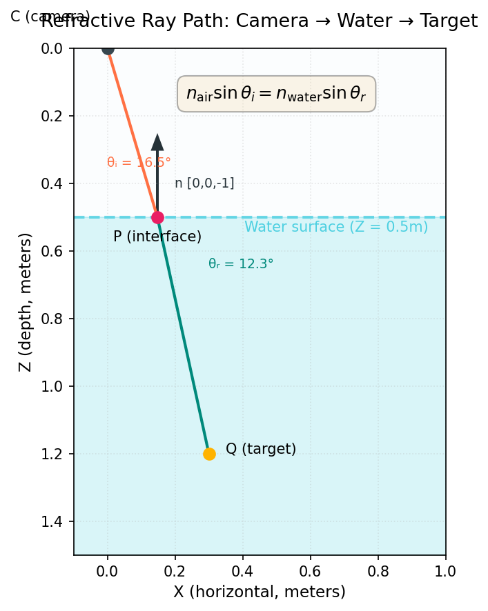

# Refractive Geometry

AquaCal models the optical path of light rays traveling from underwater calibration targets, through the air-water interface, and into cameras positioned above the water. Understanding this refractive geometry is essential for interpreting how the calibration works and why it differs from standard pinhole calibration.

## Physical Setup

In a typical AquaCal calibration setup, an array of cameras is mounted in air (near Z ≈ 0), pointing downward at a flat water surface (Z = water_z). A calibration board sits underwater (Z > water_z). Light from board corners travels upward through water, refracts at the interface, continues through air, and enters the cameras.

The key physical insight: **light bends at the interface**. A straight ray in water becomes a bent ray when viewed from air, and vice versa. This refraction changes the apparent position of underwater points when viewed from above.

## Snell's Law

Snell's law governs how light bends when crossing the boundary between two media with different refractive indices.

### Scalar Form

The classic scalar form relates the angles of incidence and refraction:

$$
n_{\text{air}} \sin\theta_i = n_{\text{water}} \sin\theta_r
$$

where:
- $n_{\text{air}} \approx 1.000$ (refractive index of air)
- $n_{\text{water}} \approx 1.333$ (refractive index of water)
- $\theta_i$ is the angle between the incident ray and the surface normal
- $\theta_r$ is the angle between the refracted ray and the surface normal

### 3D Vector Form

AquaCal uses the 3D vector form of Snell's law, which operates on ray directions rather than angles:

$$
\mathbf{t} = \eta \mathbf{d} + \left(\cos\theta_t - \eta \cos\theta_i\right) \mathbf{n}
$$

where:
- $\mathbf{d}$ is the unit incident ray direction
- $\mathbf{t}$ is the unit refracted ray direction
- $\mathbf{n}$ is the surface normal (oriented to point into the destination medium)
- $\eta = n_1 / n_2$ is the refractive index ratio
- $\cos\theta_i = |\mathbf{d} \cdot \mathbf{n}|$
- $\cos\theta_t = \sqrt{1 - \eta^2(1 - \cos^2\theta_i)}$

The implementation handles the normal orientation automatically. See {func}`aquacal.core.refractive_geometry.snells_law_3d` for the full implementation.

### Visualizing Refraction

The diagram below shows a cross-section of a ray path from a camera in air to an underwater target:

Key observations:
- The incident ray (red) travels from the camera C downward through air toward the interface
- At point P on the interface, the ray refracts according to Snell's law
- The refracted ray (green) continues through water to reach the underwater target Q
- The interface normal **n** points upward (from water toward air: [0, 0, -1])
- The incident angle $\theta_i$ is larger than the refracted angle $\theta_r$ because light entering a denser medium bends **toward** the normal

:::{admonition} Gotcha: Interface Normal Direction
:class: warning

The interface normal is defined as `[0, 0, -1]`, which points **upward** (from water toward air). This is the outward normal when viewed from the water side. The sign might seem counterintuitive given the Z-down world frame, but it's consistent with the "outward from denser medium" convention.

The {func}`~aquacal.core.refractive_geometry.snells_law_3d` function handles normal orientation internally, so you don't need to flip it manually depending on ray direction.
:::

## Ray Tracing Through the Interface

Given a camera position C in air and an underwater target point Q, how do we find where the light ray crosses the interface?

### The 1D Snell Equation

The problem reduces to finding the interface crossing point P where Snell's law is satisfied. Due to rotational symmetry about the vertical axis through C, this becomes a **1D root-finding problem** for the horizontal distance $r_p$ from C to P:

$$
f(r_p) = n_{\text{air}} \sin\theta_{\text{air}} - n_{\text{water}} \sin\theta_{\text{water}} = 0
$$

where:
- $\sin\theta_{\text{air}} = r_p / \sqrt{r_p^2 + h_c^2}$
- $\sin\theta_{\text{water}} = (r_q - r_p) / \sqrt{(r_q - r_p)^2 + h_q^2}$
- $h_c = \text{water_z} - C_z$ is the camera-to-interface gap
- $h_q = Q_z - \text{water_z}$ is the interface-to-point gap
- $r_q = \|\mathbf{Q}_{xy} - \mathbf{C}_{xy}\|$ is the horizontal offset between camera and target

This function is **strictly monotonic** and crosses zero exactly once in the interval $(0, r_q)$, guaranteeing a unique solution.

### Newton-Raphson Solution

AquaCal uses Newton-Raphson iteration to solve for $r_p$:

1. **Initial guess**: Use the pinhole/straight-line approximation: $r_p = r_q \cdot h_c / (h_c + h_q)$
2. **Update**: $r_p \leftarrow r_p - f(r_p) / f'(r_p)$
3. **Convergence**: Typically 2-4 iterations achieve sub-micrometer accuracy

The derivative $f'(r_p)$ has a closed form, making the iteration very fast. Once $r_p$ converges, the interface point is:

$$
\mathbf{P} = \mathbf{C} + r_p \cdot \text{(unit XY direction from C to Q)} + [0, 0, \text{water_z} - C_z]
$$

This Newton-Raphson approach is **~50× faster** than bracketing methods like Brent's method, while maintaining excellent numerical stability. See {func}`aquacal.core.refractive_geometry.refractive_project` for the implementation.

:::{admonition} Gotcha: water_z is a Z-coordinate, not a distance
:class: warning

Despite its name, the `water_z` parameter in AquaCal is actually the **Z-coordinate of the water surface** in the world frame (the value of water_z), **not** the physical distance from a camera to the water.

The physical camera-to-water gap $h_c$ is computed internally as `water_z - C_z`, where `C_z` is the camera's Z position in world coordinates.

For the reference camera at the world origin (C_z = 0), the water_z equals the physical gap. For other cameras at slightly different heights, the gap differs, but all cameras share the same water_z value (the global water surface Z).

This reparameterization eliminates a mathematical degeneracy between camera Z position and interface distance. See the [Optimizer Pipeline](optimizer.md) page for details.
:::

## Projection Model

### Forward Projection: 3D Point → Pixel

Given an underwater 3D point Q in world coordinates, how does it project to a pixel in a camera image?

**Standard pinhole projection** (no refraction) simply transforms Q to camera coordinates, then applies the camera intrinsics:

$$
\mathbf{p}_{\text{cam}} = \mathbf{R} \mathbf{Q} + \mathbf{t}, \quad
\text{pixel} = \mathbf{K} \begin{bmatrix} p_x / p_z \\ p_y / p_z \\ 1 \end{bmatrix}
$$

**Refractive projection** accounts for the bent light path:

1. Solve for the interface crossing point P using the Newton-Raphson method above
2. Project P (not Q) through the standard pinhole model

This works because the camera observes the **air segment** of the refracted ray, which travels from C through P. Any point on this segment (including P itself) projects to the same pixel.

The refractive projection is implemented in {func}`~aquacal.core.refractive_geometry.refractive_project` and vectorized in {func}`~aquacal.core.refractive_geometry.refractive_project_batch`.

### When Refraction Matters

Refraction effects are most significant when:
- **Depth is large**: Targets far below the water surface
- **Off-axis viewing**: Cameras viewing at steep angles (large horizontal offset)
- **High-precision applications**: Sub-millimeter 3D reconstruction

For shallow water (~10cm depth) and near-vertical viewing, pinhole projection is often adequate. But for typical AquaCal setups with 0.5-2m underwater depth and wide camera arrays, **ignoring refraction introduces systematic depth-dependent bias** that grows with distance from the rig center.

See the [Optimizer Pipeline](optimizer.md) page for more on when to use refractive vs. standard calibration.

## See Also

- [Coordinate Conventions](coordinates.md) — World frame, camera frame, and interface normal definitions
- [Optimizer Pipeline](optimizer.md) — How refractive projection fits into the calibration pipeline
- {mod}`aquacal.core.refractive_geometry` — API reference for projection and ray tracing functions
